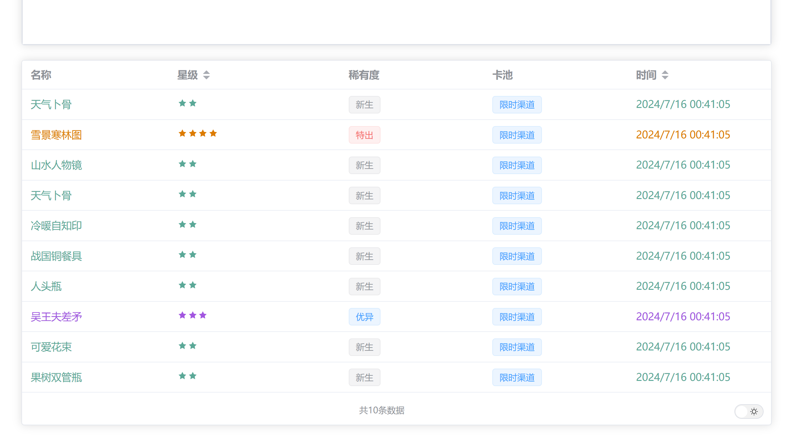

<!--
 * @Author: Night-stars-1 nujj1042633805@gmail.com
 * @Date: 2024-07-16 01:05:12
 * @LastEditTime: 2024-07-16 01:08:23
 * @LastEditors: Night-stars-1 nujj1042633805@gmail.com
-->
# wuhua_analysis
这是一个基于Vue3和ElementUI开发的物化弥新抽卡分析工具。

## 功能
- 连接游戏服务器获取抽卡记录
- 统计各个卡池的优异角色数量、特出角色数量、保底次数及平均特出间隔

## 使用
1. 安装依赖
```
npm install
```
2. 运行
```
npm run dev
```
1. 输入物华弥新`code`和`uid`

## 示例


## 特别鸣谢
星穹铁道抽卡分析 (https://github.com/wmlsj/Star_Rail_Analysis)
